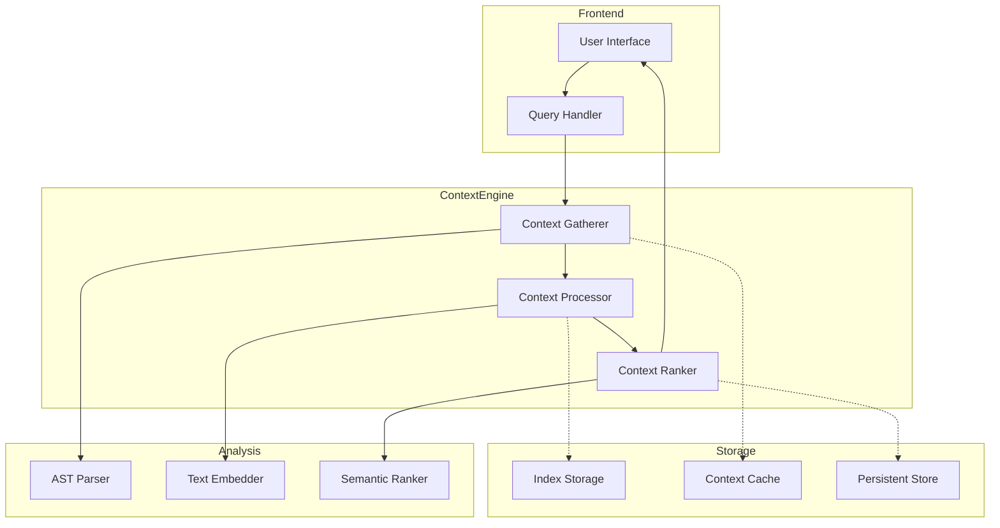
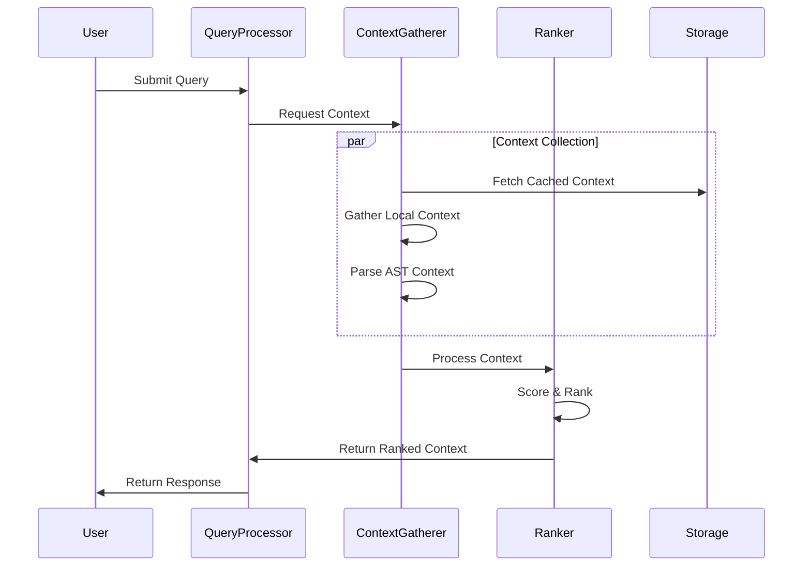

# Technical Documentation: Context-Aware Code Repository Indexing System

## Overview
This document details the architecture and implementation of a sophisticated context-aware code repository indexing system, designed for intelligent code understanding and retrieval. The system combines multiple strategies for context gathering, ranking, and retrieval to provide relevant code snippets and context for LLM interactions.

## System Architecture

### 1. Core Components



### 2. Data Flow Architecture



## Implementation Details

### 1. Context Gathering

#### a. Local Context Collection
```typescript
interface ContextGatheringService {
    updateCache(model: ITextModel, pos: Position): Promise<void>;
    getCachedSnippets(): string[];
    gatherNearbySnippets(model: ITextModel, pos: Position, numLines: number): Promise<string[]>;
    gatherParentSnippets(model: ITextModel, pos: Position, numLines: number): Promise<string[]>;
}
```

#### b. AST-Based Context
- Walks the Abstract Syntax Tree
- Identifies structural relationships
- Maintains parent-child relationships
- Preserves scope awareness

#### c. Semantic Context
```typescript
class TfIdfCalculator {
    calculateScores(query: string, token: CancellationToken): TfIdfScore[] {
        const embedding = this.computeEmbedding(query);
        const idfCache = new Map<string, number>();
        const scores: TfIdfScore[] = [];

        for (const [key, doc] of this.documents) {
            for (const chunk of doc.chunks) {
                const score = this.computeSimilarityScore(chunk, embedding, idfCache);
                if (score > 0) {
                    scores.push({ key, score });
                }
            }
        }
        return scores;
    }
}
```

### 2. Ranking System

#### a. Multi-Factor Scoring
```typescript
interface RankingFactors {
    tfIdfScore: number;
    fuzzyScore: number;
    proximityScore: number;
    semanticScore: number;
    astRelevance: number;
}
```

#### b. Score Normalization
```typescript
function normalizeScores(scores: TfIdfScore[]): NormalizedScore[] {
    const result = scores.slice(0);
    result.sort((a, b) => b.score - a.score);

    const max = result[0]?.score ?? 0;
    if (max > 0) {
        for (const score of result) {
            score.score /= max;
        }
    }
    return result;
}
```

### 3. Storage Architecture

#### a. Caching Strategy
```typescript
interface CacheStrategy {
    shortTermCache: Map<string, ContextData>;
    persistentCache: IndexedDBStorage;
    cachePolicy: CachePolicy;
}

interface CachePolicy {
    maxAge: number;
    maxSize: number;
    priorityFunction: (data: ContextData) => number;
}
```

#### b. Index Structure
```typescript
interface IndexStructure {
    documentIndex: Map<string, DocumentMetadata>;
    termIndex: Map<string, TermFrequency>;
    embeddings: Map<string, Vector>;
    astIndex: Map<string, ASTNode>;
}
```

### 4. Query Processing

#### a. Query Analysis
```typescript
interface QueryProcessor {
    parseQuery(query: string): ParsedQuery;
    expandQuery(parsed: ParsedQuery): ExpandedQuery;
    matchContext(expanded: ExpandedQuery, context: Context): MatchResult;
}
```

#### b. Context Matching
```typescript
interface ContextMatcher {
    exactMatch: boolean;
    fuzzyMatch: boolean;
    semanticMatch: boolean;
    astMatch: boolean;
    score: number;
}
```

## Performance Optimizations

### 1. Lazy Loading
- Compute embeddings on-demand
- Cache frequently accessed contexts
- Implement progressive loading for large files

### 2. Intelligent Caching
```typescript
interface CacheOptimization {
    preloadProbable: () => void;
    evictUnlikely: () => void;
    maintainFrequency: () => void;
}
```

### 3. Parallel Processing
```typescript
async function gatherContext(query: string): Promise<Context> {
    const [
        localContext,
        astContext,
        semanticContext
    ] = await Promise.all([
        gatherLocalContext(query),
        gatherASTContext(query),
        gatherSemanticContext(query)
    ]);
    return mergeContexts([localContext, astContext, semanticContext]);
}
```

## Context Processing Pipeline

### 1. Pre-processing
```typescript
interface PreProcessor {
    tokenize(text: string): Token[];
    normalize(tokens: Token[]): NormalizedToken[];
    filter(tokens: NormalizedToken[]): FilteredToken[];
}
```

### 2. Processing
```typescript
interface Processor {
    extractFeatures(tokens: Token[]): Features;
    computeEmbeddings(features: Features): Embeddings;
    rankRelevance(embeddings: Embeddings): RankedResults;
}
```

### 3. Post-processing
```typescript
interface PostProcessor {
    deduplicate(results: Result[]): Result[];
    normalize(results: Result[]): NormalizedResult[];
    format(results: NormalizedResult[]): FormattedResult[];
}
```

## Implementation Guidelines

### 1. Setup
1. Initialize storage systems (IndexedDB, Memory Cache)
2. Set up AST parser and processors
3. Configure embedding models
4. Initialize ranking systems

### 2. Context Gathering
1. Implement local context collectors
2. Set up AST walkers
3. Configure semantic analysis
4. Implement caching strategies

### 3. Ranking Implementation
1. Implement TF-IDF calculator
2. Set up fuzzy matching
3. Configure semantic ranking
4. Implement score normalization

### 4. Query Processing
1. Implement query parser
2. Set up query expansion
3. Configure context matching
4. Implement result formatting

## Best Practices

1. **Context Management**
   - Maintain hierarchical context structure
   - Implement smart context merging
   - Use efficient context pruning

2. **Performance**
   - Implement lazy computation
   - Use efficient caching strategies
   - Optimize memory usage

3. **Scalability**
   - Design for large codebases
   - Implement efficient indexing
   - Use streaming where possible

4. **Maintenance**
   - Keep indices updated
   - Implement garbage collection
   - Monitor system performance


## Error Handling

```typescript
interface ErrorHandler {
    handleIndexError(error: IndexError): void;
    handleQueryError(error: QueryError): void;
    handleContextError(error: ContextError): void;
    handleRankingError(error: RankingError): void;
}
```

This documentation provides a comprehensive overview of the system's architecture and implementation details. Engineers can use this as a reference to implement similar functionality in their own systems, adapting the components and strategies to their specific needs while maintaining the core principles of efficient context awareness and retrieval.
