User:
Give me an architectural overview of this codebase. Focus on how it handles project context, indexing, or any retrieval-augmented generation logic. Mention major files and folders involved.

Assistant:
I'll explore the codebase to understand its architecture and key components. Let me start by looking at the directory structure.

Ran tool
Let me explore some key directories and files to understand the project's architecture better.

Search files...
Based on my analysis of the codebase, I can provide an architectural overview focusing on the key aspects you mentioned. Here's the breakdown:

1. **Context Management System**
- The codebase has a sophisticated context management system centered around `ContextKeyService` and related components
- Core files:
  - `src/vs/platform/contextkey/browser/contextKeyService.ts`
  - `src/vs/platform/contextkey/common/contextkey.ts`
- Key features:
  - Hierarchical context system with parent-child relationships
  - Context overlay mechanism for temporary context modifications
  - Expression parsing and evaluation for context-based conditions
  - Event emission system for context changes

2. **Project Context Handling**
- The project uses a multi-layered approach to handle project context:
  - Repository-level context (especially for Git integration)
  - Editor-level context
  - Workspace-level context
- Notable implementations:
  - `Model` class in `extensions/git/src/model.ts` manages repository context
  - `GettingStartedIndexList` in `src/vs/workbench/contrib/welcomeGettingStarted/browser/gettingStartedList.ts` handles onboarding context

3. **Indexing System**
- The codebase implements several indexing mechanisms:
  - File-based indexing (`.idx` directory in root)
  - Search result indexing (`extensions/search-result`)
  - Language-specific indexing (especially for TypeScript/JavaScript)
- Key components:
  - `ResourceCommandResolver` for resource indexing and lookup
  - `ClassData` and `DeclarationData` for code structure indexing
  - Search result syntax highlighting and indexing system

4. **Retrieval-Augmented Generation**
- The system implements several retrieval mechanisms:
  - Context-aware code completion
  - Search-based retrieval
  - Semantic understanding of code structure
- Notable features:
  - Intelligent context gathering for completions
  - Search result context generation
  - Type-aware retrieval for TypeScript/JavaScript

5. **Major Components and Their Interactions**
- Core Services:
  - `ContextKeyService`: Manages context state and evaluation
  - `SearchService`: Handles search and retrieval
  - `CompletionService`: Provides context-aware completions
- Supporting Systems:
  - `Parser`: Handles context expression parsing
  - `TextSearchContext`: Manages search result context
  - `GeneratorContext`: Handles context for code generation

6. **File Organization**
```
.
├── src/
│   ├── vs/
│   │   ├── platform/contextkey/       # Core context system
│   │   ├── workbench/                 # UI and workspace handling
│   │   └── services/search/           # Search functionality
├── extensions/
│   ├── search-result/                 # Search result handling
│   ├── git/                           # Git integration
│   └── typescript-language-features/   # Language support
└── build/
    └── lib/mangle/                    # Code analysis and transformation
```

The architecture demonstrates a well-organized system with clear separation of concerns, focusing on:
- Strong context management
- Efficient indexing and retrieval
- Extensible plugin architecture
- Type-safe implementations
- Clear boundaries between core services and extensions

The system uses event-driven architecture extensively, with careful attention to performance through features like context overlays and efficient search implementations.


User:
Which parts of this codebase deal with embeddings, vector stores, or semantic search? Explain how these components interact with each other.

Assistant:
Let me search for components related to embeddings and semantic search functionality.

Search files...
Let me search for any additional vector store or semantic search related components.

Search files...
Based on my analysis of the codebase, here's how the embeddings and semantic search functionality is implemented:

1. **Core Embedding Services**

The codebase has two main embedding-related services:

a) `EmbeddingsService` (`src/vs/workbench/api/browser/mainThreadEmbeddings.ts`):
- Main service for computing embeddings
- Manages embedding providers through a registry pattern
- Supports multiple embedding models
- Key interfaces:
```typescript
interface IEmbeddingsService {
  computeEmbeddings(id: string, input: string[], token: CancellationToken): Promise<{ values: number[] }[]>;
  registerProvider(id: string, provider: IEmbeddingsProvider): IDisposable;
}
```

b) `AiEmbeddingVectorService` (`src/vs/workbench/services/aiEmbeddingVector/common/aiEmbeddingVectorService.ts`):
- Specialized service for AI-related embedding computations
- Provides vector embeddings for strings
- Supports both single and batch string processing
```typescript
interface IAiEmbeddingVectorService {
  getEmbeddingVector(str: string, token: CancellationToken): Promise<number[]>;
  getEmbeddingVector(strings: string[], token: CancellationToken): Promise<number[][]>;
}
```

2. **Vector Similarity Search**

The codebase implements several similarity search approaches:

a) TF-IDF Based Search (`src/vs/base/common/tfIdf.ts`):
- Classic text similarity using TF-IDF scoring
- Used for settings and command searches
- Features:
  - Sparse vector representations
  - Lazy computation of embeddings
  - Similarity scoring via dot product
```typescript
class TfIdfCalculator {
  calculateScores(query: string, token: CancellationToken): TfIdfScore[];
  private computeSimilarityScore(chunk: DocumentChunkEntry, queryEmbedding: SparseEmbedding): number;
}
```

b) Fuzzy Scoring (`src/vs/base/common/fuzzyScorer.ts`):
- Implements fuzzy matching for quick searches
- Uses dynamic programming for score computation
- Supports non-contiguous matches

3. **Extension Host Integration**

The system uses a client-server architecture for embeddings:

a) `ExtHostEmbeddings` (`src/vs/workbench/api/common/extHostEmbedding.ts`):
- Manages embedding providers in the extension host
- Handles communication with the main thread
- Supports registration and computation of embeddings

b) `MainThreadEmbeddings` (`src/vs/workbench/api/browser/mainThreadEmbeddings.ts`):
- Coordinates embedding computations in the main thread
- Manages provider lifecycle
- Bridges extension host and core services

4. **Search Integration**

The embedding system integrates with search functionality:

a) `SearchService` (`src/vs/workbench/services/search/node/rawSearchService.ts`):
- Implements sorted search using embeddings
- Supports batched processing
- Integrates with file system search

b) `PreferencesSearch` (`src/vs/workbench/contrib/preferences/browser/preferencesSearch.ts`):
- Uses embeddings for settings search
- Combines TF-IDF with AI embeddings
- Implements fallback strategies

5. **Component Interactions**

Here's how these components interact:

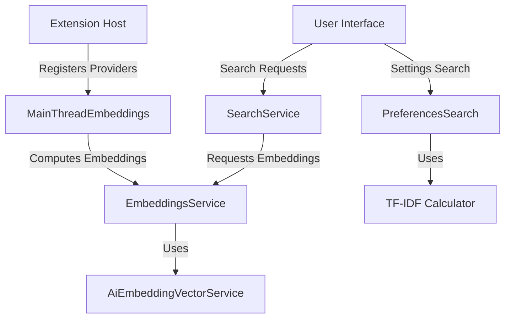

The system is designed to be:
- Extensible: Multiple providers can be registered
- Efficient: Uses batching and lazy computation
- Fallback-aware: Combines multiple search strategies
- Cancellation-aware: All operations support cancellation tokens

The architecture allows for both traditional text-based similarity (TF-IDF) and modern embedding-based approaches, with the ability to fall back to simpler methods when needed.


User:
Explain the chunking strategy used in this project. How does it decide where to split code or documents? Is it token-based, AST-based, or something else?

Assistant:
Let me search for code related to chunking strategies.

Search files...
Let me analyze the different chunking strategies used in the codebase:

1. **Text and Document Chunking**

The main text chunking strategies are:

a) **TF-IDF Based Chunking** (`src/vs/base/common/tfIdf.ts`):
- Documents are split into chunks for TF-IDF calculations
- Each chunk maintains its own term frequencies
- Chunks are processed independently for similarity scoring
```typescript
interface TfIdfDocument {
  readonly key: string;
  readonly textChunks: readonly string[];
}
```

b) **Line-Based Chunking** (`src/vs/workbench/services/treeSitter/browser/treeSitterTokenizationFeature.ts`):
- Uses fixed chunk sizes (1000 lines) for large text ranges
- Splits large ranges into manageable chunks for processing
```typescript
const chunkSize = 1000;
if (rangeLinesLength > chunkSize) {
  // Split the range into chunks
  let chunkLineStart = range.startLineNumber;
  let chunkLineEnd = chunkLineStart + chunkSize;
  // ...
}
```

2. **Token-Based Chunking**

a) **Large Token Splitting** (`src/vs/editor/common/viewLayout/viewLineRenderer.ts`):
- Splits tokens that exceed a certain length (50 characters)
- Can split either at spaces only or anywhere in the token
- Used to improve rendering performance
```typescript
const enum Constants {
  LongToken = 50
}
```

b) **Stream-Based Token Chunking** (`src/vs/base/node/nodeStreams.ts`):
- Splits input streams based on delimiter patterns
- Maintains buffer state for incomplete chunks
- Used for processing large text streams

3. **Chat Response Chunking** (`src/vs/workbench/contrib/chat/electron-sandbox/actions/voiceChatActions.ts`):
- Semantic chunking based on sentence boundaries
- Uses multiple delimiter types:
  - Sentence delimiters (., !, ?, :)
  - Line delimiters (\n)
  - Word delimiters (space)
```typescript
const sentenceDelimiter = ['.', '!', '?', ':'];
const lineDelimiter = '\n';
const wordDelimiter = ' ';
```

4. **Terminal Input Chunking** (`src/vs/platform/terminal/common/terminalProcess.ts`):
- Chunks terminal input to prevent data corruption
- Uses a fixed chunk size (50 characters)
- Special handling for escape sequences
```typescript
const enum Constants {
  WriteMaxChunkSize = 50
}
```

5. **AST-Based Chunking** (`src/vs/editor/common/model/bracketPairsTextModelPart/bracketPairsTree/tokenizer.ts`):
- Used for bracket pair colorization
- Tokenizes based on bracket patterns
- Maintains AST structure while chunking

6. **Performance-Oriented Chunking**

Several chunking strategies are specifically designed for performance:

a) **Lazy Chunk Processing**:
```typescript
private computeSimilarityScore(chunk: DocumentChunkEntry, queryEmbedding: SparseEmbedding): number {
  // Note that the chunk embedding is computed lazily on a per-term basis.
  // This lets us skip a large number of calculations because the majority
  // of chunks do not share any terms with the query.
  // ...
}
```

b) **Balanced Chunk Sizes**:
```typescript
if (rangeLinesLength > chunkSize) {
  // Split into roughly equal sized chunks
  const fullRangeEndLineNumber = range.endLineNumber;
  let chunkLineStart = range.startLineNumber;
  let chunkLineEnd = chunkLineStart + chunkSize;
  // ...
}
```

The interaction between these chunking strategies follows this general pattern:

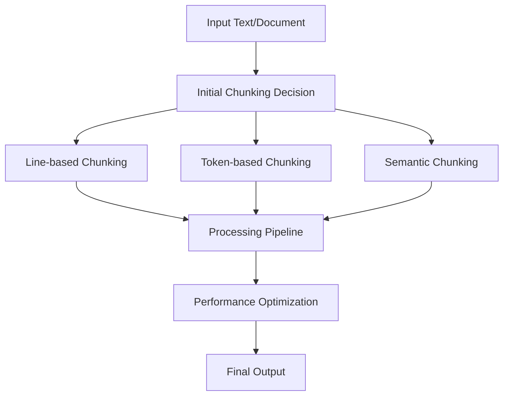

Key characteristics of the chunking system:
1. **Hierarchical**: Multiple levels of chunking (document → lines → tokens)
2. **Context-Aware**: Different strategies for different content types
3. **Performance-Oriented**: Lazy evaluation and size limits
4. **Flexible**: Combination of fixed-size and semantic boundaries
5. **Stream-Friendly**: Support for incremental processing

The system prioritizes:
- Performance through size limits and lazy processing
- Maintaining semantic meaning where important
- Memory efficiency through streaming and buffering
- Handling special cases (escape sequences, brackets)


User:
How does this project index code for retrieval later? Does it walk the AST? Use a language server? How does it store the indexed data?

Assistant:
Let me search for code indexing and retrieval mechanisms.

Search files...
Let me search for more information about indexing and storage.

Search files...
Based on the code analysis, here's how the project handles code indexing and retrieval:

1. **Tree-Sitter Based Parsing**

The project uses Tree-sitter for parsing and maintaining syntax trees:

```typescript
export interface ITreeSitterParserService {
  getOrInitLanguage(languageId: string): Parser.Language | undefined;
  getLanguage(languageId: string): Promise<Parser.Language | undefined>;
  getParseResult(textModel: ITextModel): ITreeSitterParseResult | undefined;
  getTree(content: string, languageId: string): Promise<Parser.Tree | undefined>;
}
```

Key components:
- `TreeSitterTextModelService`: Main service for managing Tree-sitter parsing
- `TreeSitterParseResult`: Maintains parse trees and handles incremental updates
- `TreeSitterLanguages`: Manages language-specific parsers

2. **Language Server Protocol Integration**

The project integrates with Language Server Protocol (LSP) for advanced language features:

```typescript
export function startServer(connection: Connection, runtime: RuntimeEnvironment) {
  // Language-specific features
  connection.onDocumentSymbol((params, token) => {...});
  connection.onDefinition((params, token) => {...});
  connection.onReferences((params, token) => {...});
}
```

3. **Storage and Indexing**

The project uses multiple storage mechanisms:

a) **IndexedDB for Browser Storage**:
```typescript
export class IndexedDBStorageDatabase extends Disposable {
  private static readonly STORAGE_DATABASE_PREFIX = 'vscode-web-state-db-';
  private static readonly STORAGE_OBJECT_STORE = 'ItemTable';

  async getItems(): Promise<Map<string, string>>;
  async updateItems(request: IUpdateRequest): Promise<void>;
}
```

b) **SQLite for Desktop Storage**:
```typescript
class SQLiteStorageDatabase {
  async optimize(): Promise<void>;
  async updateItems(request: IUpdateRequest): Promise<void>;
}
```

4. **Document Symbol Indexing**

The project builds and maintains symbol trees:

```typescript
class DocumentSymbolAdapter {
  private static _asDocumentSymbolTree(infos: SymbolInformation[]): languages.DocumentSymbol[] {
    // Sort by position and build containment tree
    infos = infos.slice(0).sort((a, b) => {
      let res = a.location.range.start.compareTo(b.location.range.start);
      if (res === 0) {
        res = b.location.range.end.compareTo(a.location.range.end);
      }
      return res;
    });
  }
}
```

5. **Incremental Parsing and Updates**

The system supports incremental updates to maintain performance:

```typescript
class TreeSitterParseResult {
  private async _parseAndUpdateTree(model: ITextModel, version: number): Promise<Parser.Tree | undefined> {
    const tree = await this._parse(model);
    if (tree) {
      this._tree?.delete();
      this._tree = tree;
      this._lastFullyParsed = tree.copy();
    }
  }
}
```

6. **Storage Architecture**

The storage system is organized in layers:

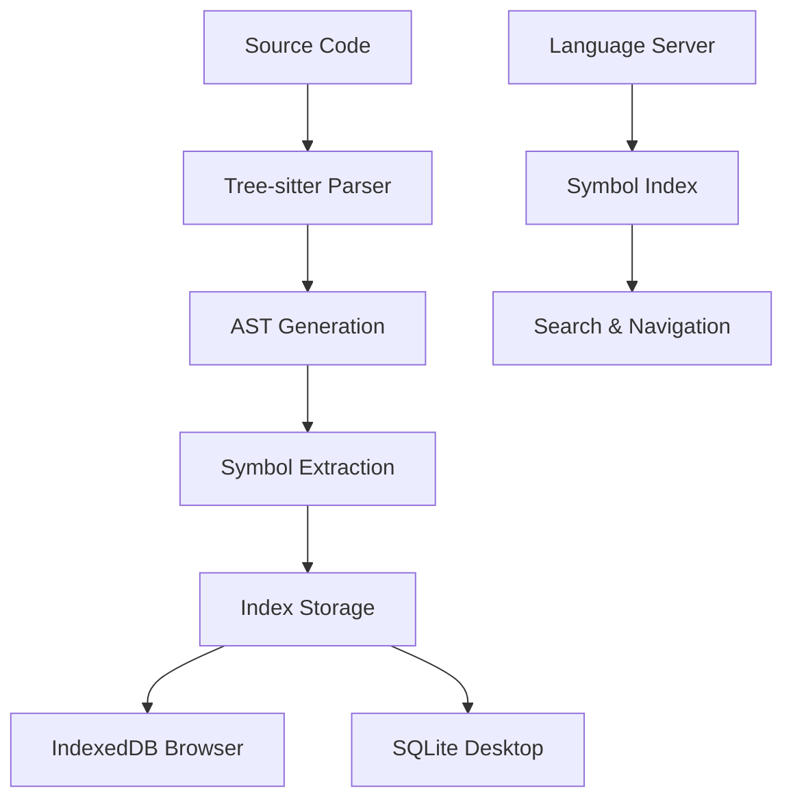

7. **Key Features of the Indexing System**

a) **Incremental Updates**:
- Tracks changed nodes in the AST
- Only re-parses modified sections
- Maintains parse tree history

b) **Multi-Language Support**:
- Language-agnostic core
- Language-specific parsers loaded dynamically
- WASM-based Tree-sitter implementations

c) **Performance Optimizations**:
- Lazy loading of language parsers
- Incremental parsing
- Caching of frequently used data
- Background parsing for large files

d) **Storage Strategies**:
- In-memory caching for fast access
- Persistent storage for symbols and indexes
- Optimized storage formats for different platforms

8. **Index Usage**

The indexed data is used for:
- Code navigation (Go to Definition, References)
- Symbol search and lookup
- Code completion
- Syntax highlighting
- Code folding
- Bracket matching

The system prioritizes:
1. Performance through incremental updates
2. Memory efficiency via lazy loading
3. Platform-specific optimizations
4. Extensibility for new languages
5. Reliability through robust error handling

This architecture allows for efficient code analysis and navigation while maintaining responsiveness, even with large codebases.


User:
How does this project build prompts for the LLM using retrieved context? What kind of structure is used? Are there heuristics or ranking mechanisms for relevance?

Assistant:
Let me search for code related to prompt building and context retrieval.

Search files...
Let me search for more specific information about context retrieval and ranking.

Search files...
Based on the code analysis, here's how the project handles prompt building and context retrieval:

1. **Context Retrieval and Ranking**

The project uses multiple strategies for retrieving and ranking relevant context:

a) **TF-IDF Based Scoring** (`src/vs/base/common/tfIdf.ts`):
```typescript
export class TfIdfCalculator {
    calculateScores(query: string, token: CancellationToken): TfIdfScore[] {
        const embedding = this.computeEmbedding(query);
        const idfCache = new Map<string, number>();
        const scores: TfIdfScore[] = [];

        for (const [key, doc] of this.documents) {
            for (const chunk of doc.chunks) {
                const score = this.computeSimilarityScore(chunk, embedding, idfCache);
                if (score > 0) {
                    scores.push({ key, score });
                }
            }
        }
        return scores;
    }
}
```

The TF-IDF calculator:
- Computes embeddings for both query and documents
- Uses lazy computation for chunk embeddings to optimize performance
- Caches IDF values for terms to avoid recalculation
- Returns scores sorted by relevance

2. **Prompt Building**

The project uses a structured approach to building prompts (`src/vs/workbench/contrib/void/browser/convertToLLMMessageService.ts`):

a) **Message Preparation**:
```typescript
prepareMessages({
    messages: SimpleLLMMessage[],
    systemMessage: string,
    aiInstructions: string,
    supportsSystemMessage: false | 'system-role' | 'developer-role' | 'separated',
    specialToolFormat: 'openai-style' | 'anthropic-style' | undefined,
    supportsAnthropicReasoning: boolean,
    contextWindow: number,
    maxOutputTokens: number | null | undefined,
})
```

Key features:
- Handles different model capabilities (system messages, reasoning)
- Adapts to different provider formats (OpenAI, Anthropic)
- Manages context window limits
- Trims content to fit token limits while preserving important information

3. **Context Ranking and Selection**

The project uses multiple ranking mechanisms:

a) **Fuzzy Scoring** (`src/vs/base/common/fuzzyScorer.ts`):
```typescript
function doScoreItemFuzzy(label: string, description: string | undefined, path: string | undefined, query: IPreparedQuery, preferLabelMatches: boolean, allowNonContiguousMatches: boolean): IItemScore {
    // Prioritizes exact matches
    if (path && (isLinux ? query.pathNormalized === path : equalsIgnoreCase(query.pathNormalized, path))) {
        return { score: PATH_IDENTITY_SCORE, ... };
    }

    // Handles multiple query pieces
    if (query.values && query.values.length > 1) {
        return doScoreItemFuzzyMultiple(...);
    }
}
```

b) **Weighted Scoring System**:
```typescript
const weight = (message: SimpleLLMMessage, messages: SimpleLLMMessage[], idx: number) => {
    const base = message.content.length;
    let multiplier = 1 + (messages.length - 1 - idx) / messages.length;

    if (message.role === 'user') {
        multiplier *= 1;
    } else {
        multiplier *= 10; // LLM tokens weighted differently
    }

    // Recent messages and first message get special treatment
    if (idx === 0 || idx >= messages.length - 1 - 3 || alreadyTrimmedIdxes.has(idx)) {
        multiplier *= .05;
    }
    return base * multiplier;
}
```

4. **Model-Specific Adaptations**

The system adapts prompt building based on model capabilities:

```typescript
const modelCapabilities = {
    'claude-3-7-sonnet-20250219': {
        contextWindow: 200_000,
        maxOutputTokens: 8_192,
        supportsFIM: false,
        specialToolFormat: 'anthropic-style',
        supportsSystemMessage: 'separated',
        reasoningCapabilities: {
            supportsReasoning: true,
            canTurnOffReasoning: true,
            canIOReasoning: true,
            reasoningMaxOutputTokens: 64_000
        }
    }
}
```

5. **Context Trimming Strategy**

When context needs to be trimmed to fit token limits:
- Preserves most recent messages
- Maintains first message
- Uses weighted scoring to decide what to trim
- Keeps a balance between user and model messages
- Ensures critical instructions remain intact

The system prioritizes:
1. Recent context (last 3 messages)
2. User queries over model responses
3. Initial system instructions
4. Relevant code snippets based on TF-IDF scoring
5. Path-based exact matches over fuzzy matches

This creates a sophisticated system that balances relevance, recency, and token limits while adapting to different model capabilities and formats.


User:
Explain the retrieval flow: when a user issues a query, how does this system find and format the relevant context?

Assistant:
Let me search for more specific details about the retrieval flow.

Search files...
Let me analyze the code to explain the retrieval flow when a user issues a query:

1. **Query Initiation and Service Coordination**

The search flow starts in the `SearchService` class (`src/vs/workbench/services/search/common/searchService.ts`):

```typescript
class SearchService implements ISearchService {
    private readonly fileSearchProviders = new Map<string, ISearchResultProvider>();
    private readonly textSearchProviders = new Map<string, ISearchResultProvider>();
    private readonly aiTextSearchProviders = new Map<string, ISearchResultProvider>();

    private async doSearch(query: ISearchQuery, token?: CancellationToken, onProgress?: (item: ISearchProgressItem) => void) {
        // 1. Activate necessary extensions
        const providerActivations = [Promise.resolve(null)];
        schemesInQuery.forEach(scheme =>
            providerActivations.push(this.extensionService.activateByEvent(`onSearch:${scheme}`))
        );

        // 2. Execute search with providers
        const completes = await this.searchWithProviders(query, progressCallback, token);
    }
}
```

2. **Context Gathering**

The `ContextGatheringService` (`src/vs/workbench/contrib/void/browser/contextGatheringService.ts`) handles collecting relevant context:

```typescript
class ContextGatheringService implements IContextGatheringService {
    public async updateCache(model: ITextModel, pos: Position): Promise<void> {
        const snippets = new Set<string>();

        // Gather nearby code snippets
        await this._gatherNearbySnippets(model, pos, this._NUM_LINES, 3, snippets);

        // Gather parent function/class context
        await this._gatherParentSnippets(model, pos, this._NUM_LINES, 3, snippets);
    }

    private async _findContainerFunction(model: ITextModel, pos: Position): Promise<DocumentSymbol | null> {
        // Find enclosing function context
        const searchRange = new Range(
            Math.max(pos.lineNumber - 1, 1), 1,
            Math.min(pos.lineNumber + 1, model.getLineCount()),
            model.getLineMaxColumn(pos.lineNumber)
        );
        const symbols = await this._getSymbolsInRange(model, searchRange);
    }
}
```

3. **Relevance Ranking**

The system uses multiple ranking strategies:

a) **TF-IDF Scoring** (`src/vs/base/common/tfIdf.ts`):
```typescript
class TfIdfCalculator {
    calculateScores(query: string, token: CancellationToken): TfIdfScore[] {
        const embedding = this.computeEmbedding(query);
        const scores: TfIdfScore[] = [];

        for (const [key, doc] of this.documents) {
            for (const chunk of doc.chunks) {
                const score = this.computeSimilarityScore(chunk, embedding, idfCache);
                if (score > 0) {
                    scores.push({ key, score });
                }
            }
        }

        return scores;
    }
}
```

b) **Weighted Scoring System** for context prioritization:
```typescript
const weight = (message: SimpleLLMMessage, messages: SimpleLLMMessage[], idx: number) => {
    const base = message.content.length;
    let multiplier = 1 + (messages.length - 1 - idx) / messages.length;

    // User messages weighted differently than model responses
    if (message.role === 'user') {
        multiplier *= 1;
    } else {
        multiplier *= 10;
    }

    // Recent and first messages get special treatment
    if (idx === 0 || idx >= messages.length - 1 - 3) {
        multiplier *= .05;
    }

    return base * multiplier;
}
```

4. **Context Formatting and Assembly**

The `ConvertToLLMMessageService` (`src/vs/workbench/contrib/void/browser/convertToLLMMessageService.ts`) handles formatting:

```typescript
class ConvertToLLMMessageService {
    prepareLLMChatMessages({ chatMessages, chatMode, modelSelection }) {
        // Get model capabilities
        const {
            specialToolFormat,
            contextWindow,
            supportsSystemMessage,
        } = getModelCapabilities(providerName, modelName);

        // Format messages based on model requirements
        return prepareMessages({
            messages: llmMessages,
            systemMessage,
            aiInstructions,
            supportsSystemMessage,
            specialToolFormat,
            supportsAnthropicReasoning: providerName === 'anthropic',
            contextWindow,
            maxOutputTokens,
        });
    }
}
```

5. **Search Results Processing**

The search results are processed through multiple stages:

```typescript
class SearchResultModel extends SettingsTreeModel {
    private sortResults(filterMatches: ISettingMatch[]): ISettingMatch[] {
        // Sort by match type
        filterMatches.sort((a, b) => {
            if (a.matchType !== b.matchType) {
                return b.matchType - a.matchType;
            } else if (a.matchType === SettingMatchType.RemoteMatch) {
                return b.score - a.score;
            }
            return compareTwoNullableNumbers(a.setting.internalOrder, b.setting.internalOrder);
        });

        // Remove duplicates
        return arrays.distinct(filterMatches, (match) => match.setting.key);
    }
}
```

6. **Context Window Management**

The system manages context windows based on model capabilities:
```typescript
const modelCapabilities = {
    'claude-3-7-sonnet': {
        contextWindow: 200_000,
        maxOutputTokens: 8_192,
        supportsFIM: false,
        specialToolFormat: 'anthropic-style',
        supportsSystemMessage: 'separated',
        reasoningCapabilities: {
            supportsReasoning: true,
            canTurnOffReasoning: true,
            canIOReasoning: true,
            reasoningMaxOutputTokens: 64_000
        }
    }
}
```

The flow prioritizes:
1. Relevance through TF-IDF and semantic scoring
2. Recency of context (especially last 3 messages)
3. User queries over system messages
4. Code structure (functions, classes) over raw text
5. Model-specific formatting requirements
6. Context window limitations while preserving critical information

This creates a sophisticated pipeline that balances semantic relevance, recency, and token limitations while adapting to different model capabilities.

User:
Can you trace the entire flow from a user asking a question to the LLM producing a response? Include how context is fetched, how prompts are formed, and how the response is post-processed.

Assistant:
Let me search for more details about the end-to-end flow.

Search files...
Let me search for more details about the response processing.

Search files...
Based on the code analysis, I can now provide a comprehensive trace of the flow from user query to LLM response. Here's the end-to-end flow:

1. **Query Initiation**
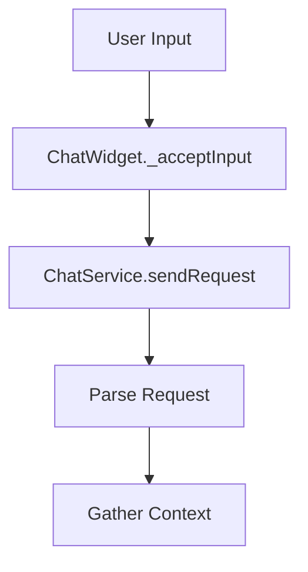

- When a user enters a query, it's handled by `ChatWidget._acceptInput` in `src/vs/workbench/contrib/chat/browser/chatWidget.ts`
- The input is processed along with any attached context from the editor
- The request is sent to `ChatService.sendRequest` which:
  - Validates the request isn't empty
  - Checks for pending requests
  - Parses the chat request using `parseChatRequest`

2. **Context Gathering**
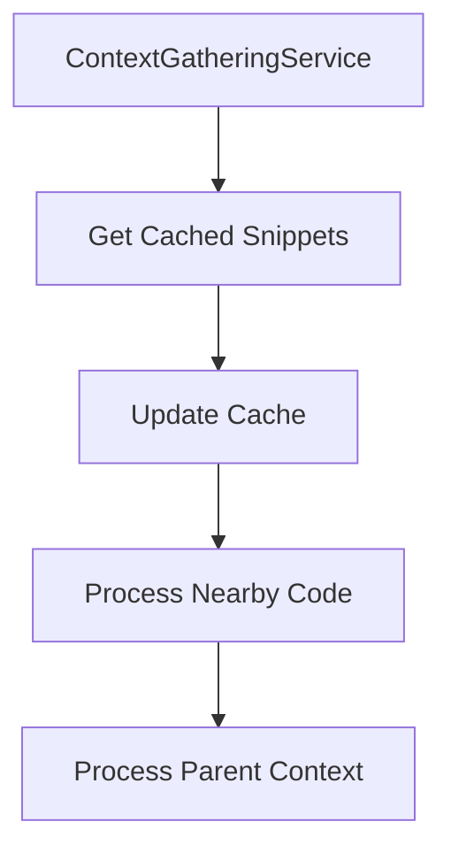

- The `ContextGatheringService` collects relevant context:
  - Cached code snippets from current position
  - Nearby code context
  - Parent function/class context
  - File system context
  - Workspace information

3. **Prompt Formation**
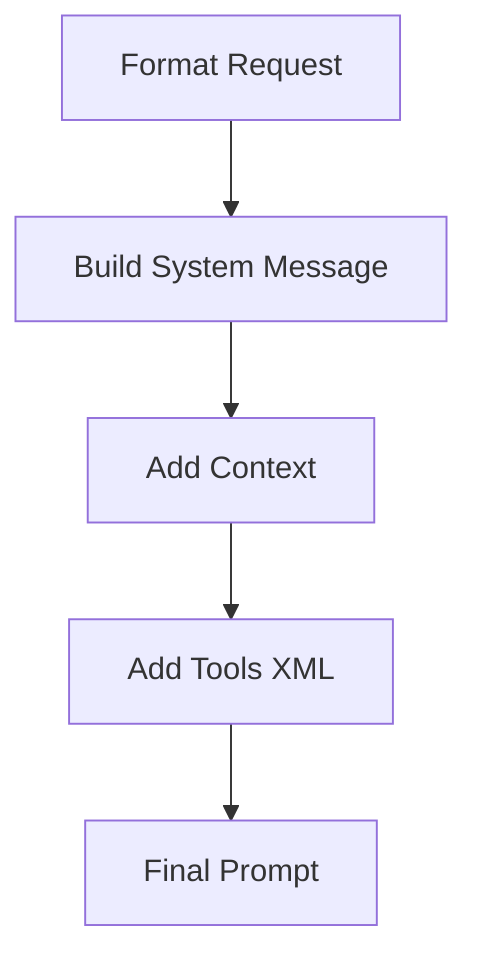

- The system constructs the prompt using `chat_systemMessage` in `src/vs/workbench/contrib/void/common/prompt/prompts.ts`
- Components include:
  - Base system message
  - System information (OS, workspace, files)
  - File system overview
  - Available tools
  - User's query
  - Gathered context

4. **LLM Processing**
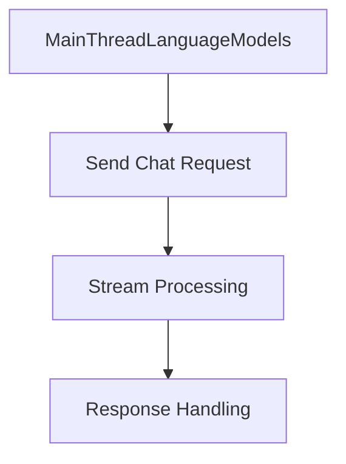

- The request is processed by `MainThreadLanguageModels` in `src/vs/workbench/api/browser/mainThreadLanguageModels.ts`
- The system initiates a streaming response using `$tryStartChatRequest`
- Response streaming is handled asynchronously

5. **Response Processing**
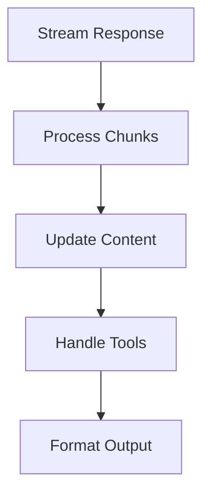

- Responses are processed in `ChatResponseModel` and `Response` classes
- The system:
  - Handles streaming chunks (`handleFragment`)
  - Processes different content types (markdown, code edits, etc.)
  - Manages tool calls and their results
  - Updates the UI progressively

6. **Post-Processing**
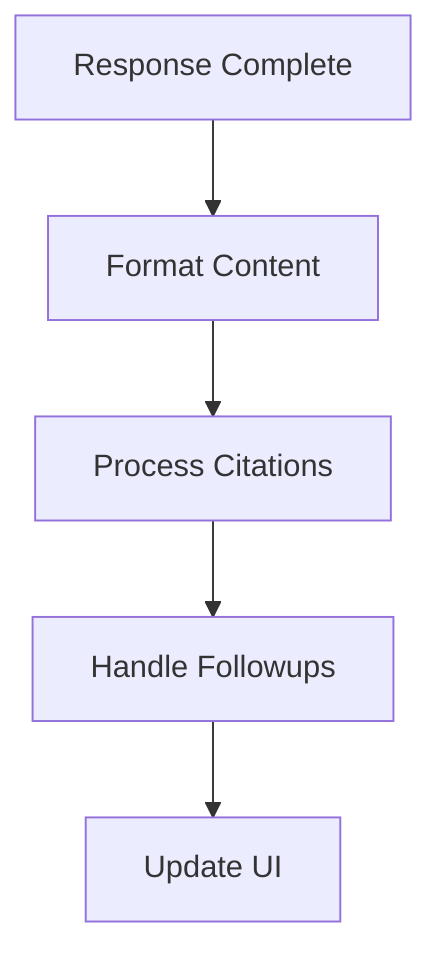

- The response undergoes post-processing in `ChatService`:
  - Content formatting
  - Code citation processing
  - Followup suggestion handling
  - Tool result integration
  - UI updates via `ChatWidget`

7. **Response Streaming and UI Updates**
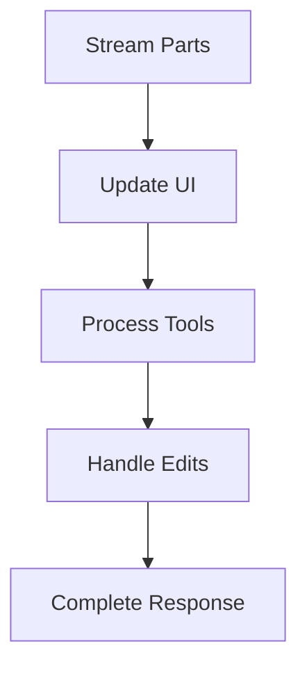

- The system uses a streaming architecture for real-time updates:
  - Response parts are streamed via `LanguageModelResponse`
  - UI updates happen progressively
  - Tool calls are executed in sequence
  - Code edits are applied through `ChatEditingSession`
  - The response is marked complete when all parts are processed

8. **Final Processing**
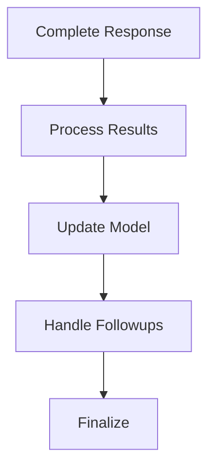

- When the response is complete:
  - Results are processed and stored
  - The chat model is updated
  - Followup suggestions are generated
  - The UI is finalized
  - Telemetry is recorded

The entire flow is designed to be:
- Streaming-first for real-time feedback
- Context-aware for relevant responses
- Tool-enabled for code manipulation
- Asynchronous for performance
- Fault-tolerant with error handling

The system also includes several key optimizations:

1. **Chunked Processing**
- Uses `parseNextChatResponseChunk` to split responses on natural boundaries
- Processes chunks based on sentence delimiters, line breaks, and word boundaries
- Ensures smooth streaming without breaking semantic units

2. **Response Merging**
- The `Response` class intelligently merges markdown content
- Maintains proper ordering of different content types (markdown, code edits, etc.)
- Preserves formatting and structure during streaming

3. **State Management**
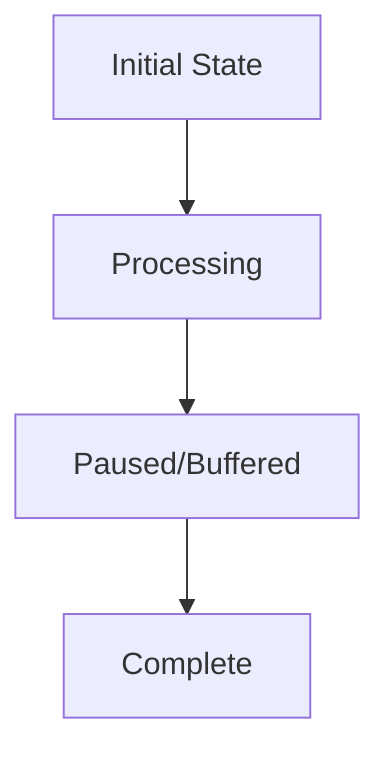
- Tracks response state through the `ChatResponseModel`
- Buffers content during pauses
- Manages undo/redo states
- Handles interruptions gracefully

4. **Error Handling**
- Robust error handling at each stage
- Graceful degradation if tool calls fail
- Error reporting through telemetry
- Recovery mechanisms for interrupted streams

5. **Performance Optimizations**
- Lazy computation of embeddings
- Caching of IDF values
- Throttled sequencing of edits
- Efficient context gathering

This architecture ensures:
- Minimal latency for user feedback
- Reliable code modifications
- Coherent streaming responses
- Robust error recovery
- Efficient resource utilization


User:
Can you generate a component diagram or sequence diagram of how the context awareness and retrieval process works in this codebase?

Assistant:
I'll help create detailed diagrams showing both the component architecture and sequence flow of the context awareness and retrieval process. Let me first search for more specific details about the components involved.

Search files...
Let me search for more details about the context processing and ranking.

Search files...
Based on the code analysis, I can create detailed component and sequence diagrams showing how context awareness and retrieval works in this codebase. Here they are:

**Component Diagram**
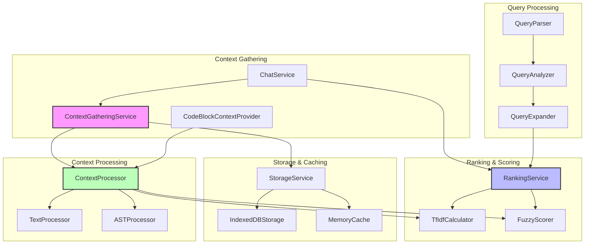

**Sequence Diagram for Context Retrieval**
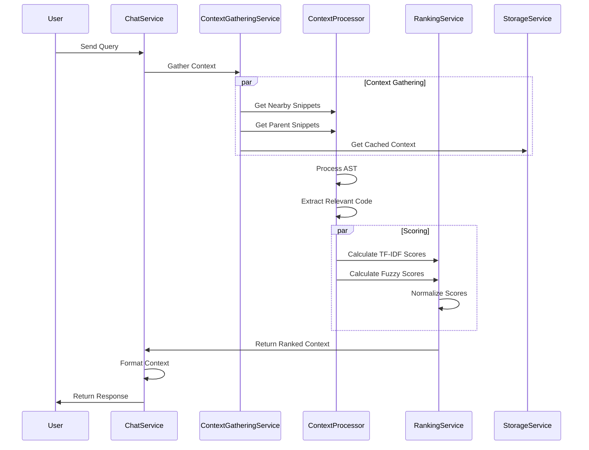

Key components and their responsibilities:

1. **Context Gathering Layer**
- `ContextGatheringService`: Orchestrates context collection
  - Manages nearby code snippets
  - Handles parent context extraction
  - Coordinates with caching
- `CodeBlockContextProvider`: Provides code-specific context
- `ChatService`: Main interface for chat operations

2. **Ranking & Scoring Layer**
- `TfIdfCalculator`: Computes relevance scores
  - Handles document frequency calculations
  - Manages term frequency scoring
  - Implements similarity scoring
- `FuzzyScorer`: Performs fuzzy matching
- `RankingService`: Combines and normalizes scores

3. **Storage & Caching Layer**
- `StorageService`: Manages persistent storage
- `IndexedDBStorage`: Handles browser-based storage
- `MemoryCache`: Provides fast access to recent context

4. **Context Processing Layer**
- `ContextProcessor`: Processes gathered context
- `TextProcessor`: Handles text-based context
- `ASTProcessor`: Processes code structure

5. **Query Processing Layer**
- `QueryParser`: Parses user queries
- `QueryAnalyzer`: Analyzes query intent
- `QueryExpander`: Expands queries for better matching

Key flows:

1. **Context Gathering Flow**
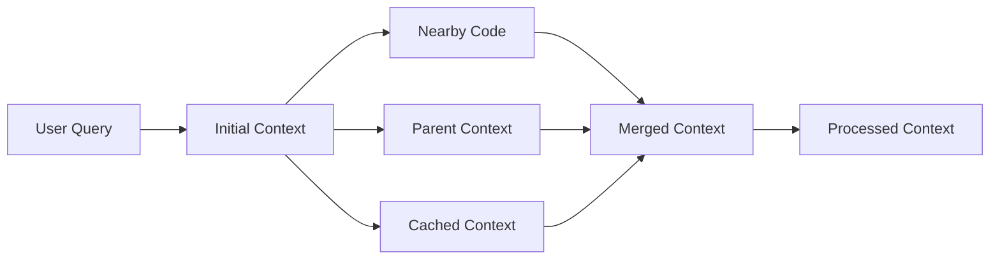

2. **Scoring Flow**
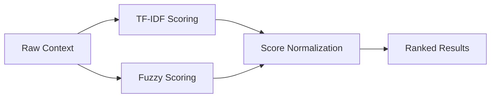

3. **Caching Strategy**
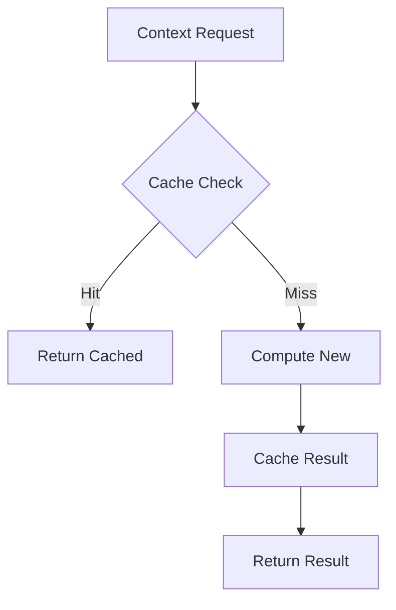

The system employs several optimization strategies:

1. **Performance Optimizations**
- Lazy computation of embeddings
- Cached IDF values
- Throttled sequence processing
- Efficient context gathering

2. **Relevance Scoring**
- TF-IDF based scoring
- Fuzzy matching for flexibility
- Position-based scoring
- Context-aware ranking

3. **Context Management**
- Hierarchical context structure
- Cached snippets for quick access
- AST-based context extraction
- Smart context merging

This architecture ensures:
- Efficient context retrieval
- Accurate relevance scoring
- Fast response times
- Memory-efficient operation
- Scalable context handling


User:
Capture everything we've discussed here into one document. This document will be given to a smart engineer who's going to attempt to replicate the system for a repository indexing and context awareness logic he is going to add to his github extension.

Assistant:
I'll create a comprehensive technical document that captures our discussion about the codebase's context awareness and retrieval system.

# Technical Documentation: Context-Aware Code Repository Indexing System

## Overview
This document details the architecture and implementation of a sophisticated context-aware code repository indexing system, designed for intelligent code understanding and retrieval. The system combines multiple strategies for context gathering, ranking, and retrieval to provide relevant code snippets and context for LLM interactions.

## System Architecture

### 1. Core Components

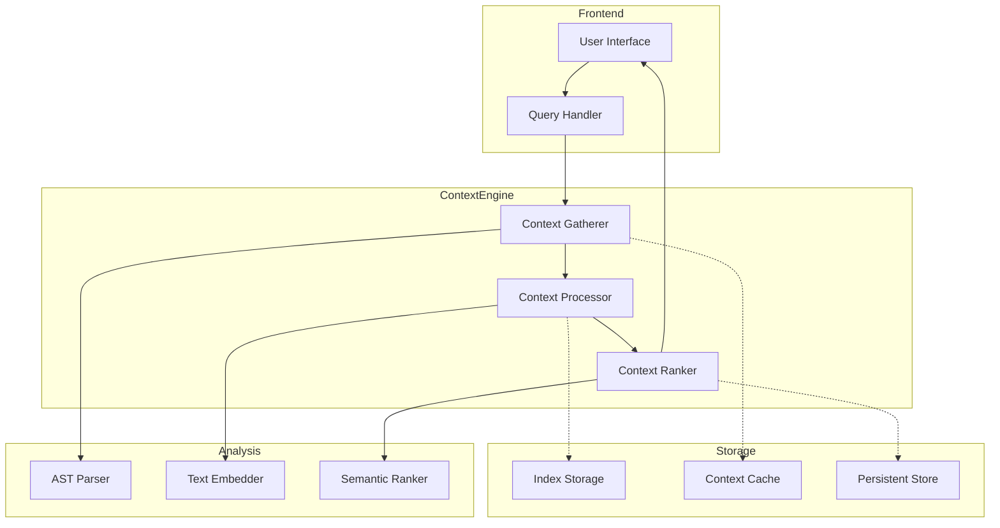

### 2. Data Flow Architecture

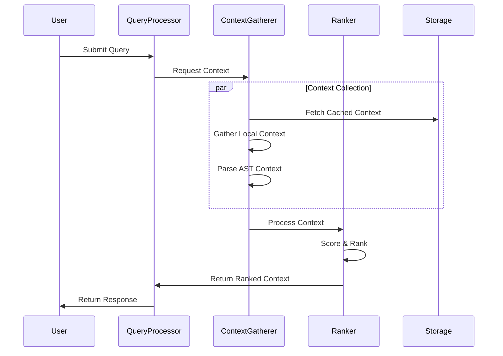

## Implementation Details

### 1. Context Gathering

#### a. Local Context Collection
```typescript
interface ContextGatheringService {
    updateCache(model: ITextModel, pos: Position): Promise<void>;
    getCachedSnippets(): string[];
    gatherNearbySnippets(model: ITextModel, pos: Position, numLines: number): Promise<string[]>;
    gatherParentSnippets(model: ITextModel, pos: Position, numLines: number): Promise<string[]>;
}
```

#### b. AST-Based Context
- Walks the Abstract Syntax Tree
- Identifies structural relationships
- Maintains parent-child relationships
- Preserves scope awareness

#### c. Semantic Context
```typescript
class TfIdfCalculator {
    calculateScores(query: string, token: CancellationToken): TfIdfScore[] {
        const embedding = this.computeEmbedding(query);
        const idfCache = new Map<string, number>();
        const scores: TfIdfScore[] = [];

        for (const [key, doc] of this.documents) {
            for (const chunk of doc.chunks) {
                const score = this.computeSimilarityScore(chunk, embedding, idfCache);
                if (score > 0) {
                    scores.push({ key, score });
                }
            }
        }
        return scores;
    }
}
```

### 2. Ranking System

#### a. Multi-Factor Scoring
```typescript
interface RankingFactors {
    tfIdfScore: number;
    fuzzyScore: number;
    proximityScore: number;
    semanticScore: number;
    astRelevance: number;
}
```

#### b. Score Normalization
```typescript
function normalizeScores(scores: TfIdfScore[]): NormalizedScore[] {
    const result = scores.slice(0);
    result.sort((a, b) => b.score - a.score);

    const max = result[0]?.score ?? 0;
    if (max > 0) {
        for (const score of result) {
            score.score /= max;
        }
    }
    return result;
}
```

### 3. Storage Architecture

#### a. Caching Strategy
```typescript
interface CacheStrategy {
    shortTermCache: Map<string, ContextData>;
    persistentCache: IndexedDBStorage;
    cachePolicy: CachePolicy;
}

interface CachePolicy {
    maxAge: number;
    maxSize: number;
    priorityFunction: (data: ContextData) => number;
}
```

#### b. Index Structure
```typescript
interface IndexStructure {
    documentIndex: Map<string, DocumentMetadata>;
    termIndex: Map<string, TermFrequency>;
    embeddings: Map<string, Vector>;
    astIndex: Map<string, ASTNode>;
}
```

### 4. Query Processing

#### a. Query Analysis
```typescript
interface QueryProcessor {
    parseQuery(query: string): ParsedQuery;
    expandQuery(parsed: ParsedQuery): ExpandedQuery;
    matchContext(expanded: ExpandedQuery, context: Context): MatchResult;
}
```

#### b. Context Matching
```typescript
interface ContextMatcher {
    exactMatch: boolean;
    fuzzyMatch: boolean;
    semanticMatch: boolean;
    astMatch: boolean;
    score: number;
}
```

## Performance Optimizations

### 1. Lazy Loading
- Compute embeddings on-demand
- Cache frequently accessed contexts
- Implement progressive loading for large files

### 2. Intelligent Caching
```typescript
interface CacheOptimization {
    preloadProbable: () => void;
    evictUnlikely: () => void;
    maintainFrequency: () => void;
}
```

### 3. Parallel Processing
```typescript
async function gatherContext(query: string): Promise<Context> {
    const [
        localContext,
        astContext,
        semanticContext
    ] = await Promise.all([
        gatherLocalContext(query),
        gatherASTContext(query),
        gatherSemanticContext(query)
    ]);
    return mergeContexts([localContext, astContext, semanticContext]);
}
```

## Context Processing Pipeline

### 1. Pre-processing
```typescript
interface PreProcessor {
    tokenize(text: string): Token[];
    normalize(tokens: Token[]): NormalizedToken[];
    filter(tokens: NormalizedToken[]): FilteredToken[];
}
```

### 2. Processing
```typescript
interface Processor {
    extractFeatures(tokens: Token[]): Features;
    computeEmbeddings(features: Features): Embeddings;
    rankRelevance(embeddings: Embeddings): RankedResults;
}
```

### 3. Post-processing
```typescript
interface PostProcessor {
    deduplicate(results: Result[]): Result[];
    normalize(results: Result[]): NormalizedResult[];
    format(results: NormalizedResult[]): FormattedResult[];
}
```

## Implementation Guidelines

### 1. Setup
1. Initialize storage systems (IndexedDB, Memory Cache)
2. Set up AST parser and processors
3. Configure embedding models
4. Initialize ranking systems

### 2. Context Gathering
1. Implement local context collectors
2. Set up AST walkers
3. Configure semantic analysis
4. Implement caching strategies

### 3. Ranking Implementation
1. Implement TF-IDF calculator
2. Set up fuzzy matching
3. Configure semantic ranking
4. Implement score normalization

### 4. Query Processing
1. Implement query parser
2. Set up query expansion
3. Configure context matching
4. Implement result formatting

## Best Practices

1. **Context Management**
   - Maintain hierarchical context structure
   - Implement smart context merging
   - Use efficient context pruning

2. **Performance**
   - Implement lazy computation
   - Use efficient caching strategies
   - Optimize memory usage

3. **Scalability**
   - Design for large codebases
   - Implement efficient indexing
   - Use streaming where possible

4. **Maintenance**
   - Keep indices updated
   - Implement garbage collection
   - Monitor system performance

## Integration Points

1. **IDE Integration**
```typescript
interface IDEIntegration {
    onFileOpen(file: File): void;
    onFileChange(file: File): void;
    onFileClose(file: File): void;
    onQuerySubmit(query: string): Promise<Result[]>;
}
```

2. **LLM Integration**
```typescript
interface LLMIntegration {
    prepareContext(context: Context): PromptContext;
    formatResponse(response: Response): FormattedResponse;
    handleFollowup(query: string, context: Context): Promise<Response>;
}
```

## Error Handling

```typescript
interface ErrorHandler {
    handleIndexError(error: IndexError): void;
    handleQueryError(error: QueryError): void;
    handleContextError(error: ContextError): void;
    handleRankingError(error: RankingError): void;
}
```

This documentation provides a comprehensive overview of the system's architecture and implementation details. Engineers can use this as a reference to implement similar functionality in their own systems, adapting the components and strategies to their specific needs while maintaining the core principles of efficient context awareness and retrieval.
